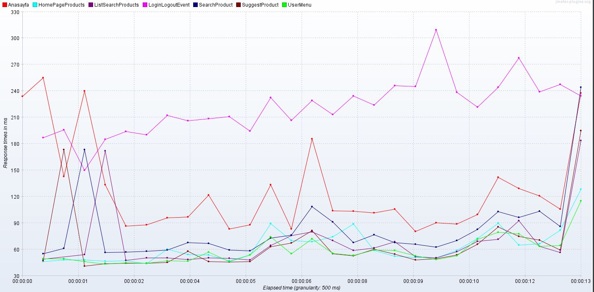
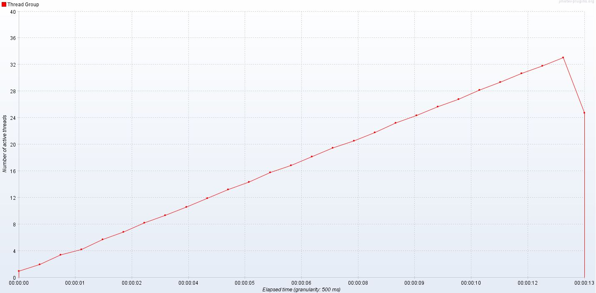
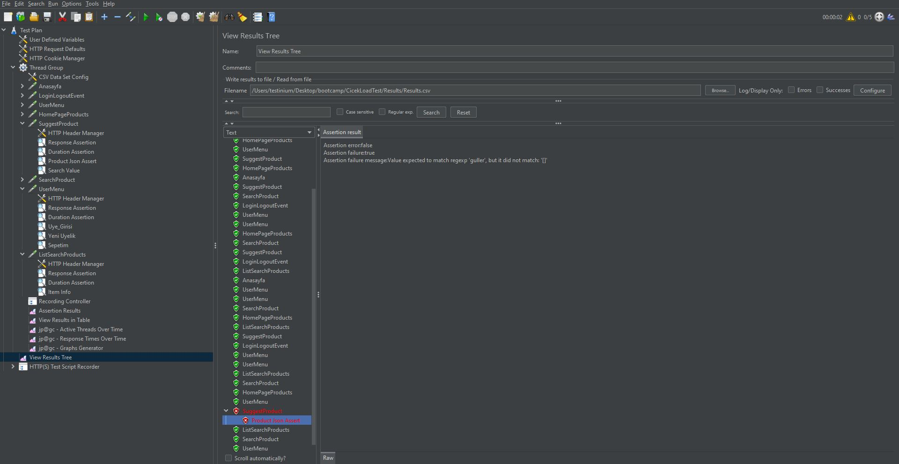
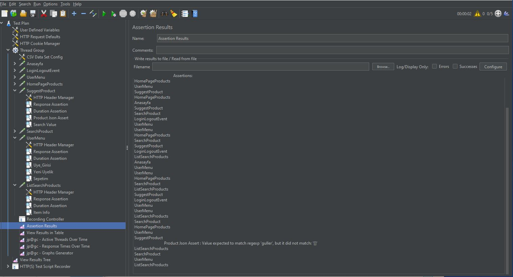

# Cicek.com Load Test

Bu projede https://www.cicek.com header da bulunan search modülü ve arama sonrası gidilen sonuçların listelendiği listeleme sayfasının yük altındaki davranışını incelemek adına yük testi yapılmıştır.
- Arama işlemi papatya,guller,orkide,lilyum ve teraryum ürünleri için yapılmıştır.
- Atılan isteklerin başarılı atıldığını kontrol etmek için çeşitli assertionlar kullanılmıştır. Bu çalışmada kullanılan assertionlar; response code, duration time, xpath assertion ve json assertiondur.
- Grafik çıktıları elde edebilmek için jmeterin jpgc plugini kullanılmıştır.
## Senaryoda atılan istekler ve bu isteklerde kullanılan assertionlar


## API İstekleri

#### Ana Sayfa

```http
  GET /
```

| Parametre | Tip     | Açıklama                |
| :-------- | :------- | :------------------------- |
| `Response Code` | `200` | **Status kod değerinin 200 dönmesinin kontrolü yapılmıştır.** |
| `Duration` | `600` | **Bu isteğin maksimum 600 ms içinde gerçekleşmesini beklediğimi belirttiğim assertion** |


#### Login Logout Event

```http
  GET /Ani/GetLoginOrLogoutEvent
```

| Parametre | Tip     | Açıklama                       |
| :-------- | :------- | :-------------------------------- |
| `Response Code` | `200` | **Status kod değerinin 200 dönmesinin kontrolü yapılmıştır.** |
| `Duration` | `400` | **Bu isteğin maksimum 400 ms içinde gerçekleşmesini beklediğimi belirttiğim assertion** |
| `JSON Assertion` | `Event Type` | **Dönen json bodyde EventType değerinde bir veri var mı kontrolü yapılmıştır.** |
| `JSON Assertion` | `Customer Identifier` | **Dönen json bodyde CustomerIdentifier değerinde bir veri var mı kontrolü yapılmıştır.** |


#### User Menu

```http
  GET /user-menu
```

| Parametre | Tip     | Açıklama                |
| :-------- | :------- | :------------------------- |
| `Response Code` | `200` | **Status kod değerinin 200 dönmesinin kontrolü yapılmıştır.** |
| `Duration` | `200` | **Bu isteğin maksimum 200 ms içinde gerçekleşmesini beklediğimi belirttiğim assertion** |
| `Xpath Assertion` | `Üye Girişi` | **//a[@href='/uye-girisi'] xpath değerinin var olup olmadığını kontrol eder** |
| `Xpath Assertion` | `Yeni Üyelik` | **//a[@href='/yeni-uyelik'] xpath değerinin var olup olmadığını kontrol eder** |
| `Xpath Assertion` | `Sepetim` | **//a[@href='/sepetim']  xpath değerinin var olup olmadığını kontrol eder** |


#### Home Page Products

```http
  GET /Product/AjaxHomePageProducts
```

| Parametre | Tip     | Açıklama                |
| :-------- | :------- | :------------------------- |
| `Response Code` | `200` | **Status kod değerinin 200 dönmesinin kontrolü yapılmıştır.** |
| `Duration` | `500` | **Bu isteğin maksimum 500 ms içinde gerçekleşmesini beklediğimi belirttiğim assertion** |
| `Xpath Assertion` | `Cicek` | **//a[@href='cicek'] xpath değerinin var olup olmadığını kontrol eder** |
| `Xpath Assertion` | `Product` | **//div[@class='products__item-info'] xpath değerinin var olup olmadığını kontrol eder** |


#### Sugest Products

```http
  GET /Suggest/Get
```

| Parametre | Tip     | Açıklama                |
| :-------- | :------- | :------------------------- |
| `Response Code` | `200` | **Status kod değerinin 200 dönmesinin kontrolü yapılmıştır.** |
| `Duration` | `500` | **Bu isteğin maksimum 500 ms içinde gerçekleşmesini beklediğimi belirttiğim assertion** |
| `JSON Assertion` | `${Product}` | **Gelen json responsenin $.Productlist[*]Query değerinin verilen product değerine (papatya, orkide vs.) eşit olup olmadığı kontrol edildi.** |
| `JSON Assertion` | `${Product}` | **Gelen json responsenin $.Categorylist[*]SearchValue değerinin verilen product değerine (papatya, orkide vs.) eşit olup olmadığı kontrol edildi.** |


 #### Search Product

```http
  GET /Arama
```

| Parametre | Tip     | Açıklama                |
| :-------- | :------- | :------------------------- |
| `Response Code` | `200` | **Status kod değerinin 200 dönmesinin kontrolü yapılmıştır.** |
| `Duration` | `500` | **Bu isteğin maksimum 500 ms içinde gerçekleşmesini beklediğimi belirttiğim assertion** |
| `Xpath Assertion` | `Tüm Ürünleri Gör` | **//a[text()='Tüm Ürünleri Gör'] xpath değerinin var olup olmadığını kontrol eder** |
| `Xpath Assertion` | `Orkide` | **//a[@href='/orkide'] xpath değerinin var olup olmadığını kontrol eder** |
| `Xpath Assertion` | `Gul` | **//a[@href='/gul'] xpath değerinin var olup olmadığını kontrol eder** |
| `Xpath Assertion` | `Papatya` | **//a[@href='/papatya-gerbera'] xpath değerinin var olup olmadığını kontrol eder** |


  #### User Menu

```http
  GET /user-menu
```

| Parametre | Tip     | Açıklama                |
| :-------- | :------- | :------------------------- |
| `Response Code` | `200` | **Status kod değerinin 200 dönmesinin kontrolü yapılmıştır.** |
| `Duration` | `200` | **Bu isteğin maksimum 200 ms içinde gerçekleşmesini beklediğimi belirttiğim assertion** |
| `Xpath Assertion` | `Üye Girişi` | **//a[@href='/uye-girisi'] xpath değerinin var olup olmadığını kontrol eder** |
| `Xpath Assertion` | `Yeni Üyelik` | **//a[@href='/yeni-uyelik'] xpath değerinin var olup olmadığını kontrol eder** |
| `Xpath Assertion` | `Sepetim` | **//a[@href='/sepetim']  xpath değerinin var olup olmadığını kontrol eder** |


  #### List Search Products

```http
  GET /Catalog/AjaxCategory
```

| Parametre | Tip     | Açıklama                |
| :-------- | :------- | :------------------------- |
| `Response Code` | `200` | **Status kod değerinin 200 dönmesinin kontrolü yapılmıştır.** |
| `Duration` | `600` | **Bu isteğin maksimum 600 ms içinde gerçekleşmesini beklediğimi belirttiğim assertion** |
| `Xpath Assertion` | `Item Info` | **//div[@class='products__item-info'] xpath değerinin var olup olmadığını kontrol eder** |


## Projenin kullanımı

- git pull ile projeyi kendi localimize çekiyoruz.
- Bilgisayarımızda kurulu olan jmeterin bin dosyasının konumuna gidip cmd ekranını açıyoruz
- jmeter -n -t "jmx dosyamızın konumu" -l "sonuçları yazdıracağımız dosyanın konumu" komutu ile projemizi çalıştırabiliriz. (Mac kullanıyorsak komutun başına sh eklememiz gerekiyor.)

## Response Time



## Number Of Active Threads (Örnek için bu kadar kullanıcı kullanılmıştır.)





## Response Results




## Assertion Result

- Burada alınan hata dönen JSON bodyde ProductListte Query değerinin guller dönmemesinden kaynaklıdır.


