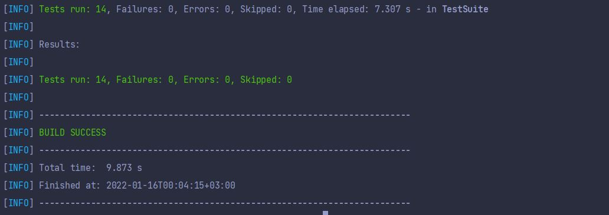

# Bootcamp API Otomasyonu

Bu projede bize verilen sign up ve sign in istekleri için entegrasyon testi yazmamış istenmiştir. Bunun proje için kullanılan dil java olup rest assured ve testng kütüphaneleri kullanılmıştır. 
- Java test otomasyon projelerinde en çok kullanılan dillerden biri ve aktif iş hayatımda kullandığım dil olduğu için bunu tercih ettim.
- TestNG kütüphanesi JUnit kütüphanesine göre daha esnek olup bu projede prioritynin gerekli olabileceğini düşündüğüm için (Hiç kullanmadım.) ve UI projesinde JUnit kullandım farklılık olması açısından TestNG kütüphanesini seçtim.
- Rest Assured kütüphanesi ise Restful servislerin otomasyonunda en çok kullanılan kütüphanelerden biridir. Benim ise Karate'den sonra tercih edeceğim bir kütüphane rest assured. Bu projede karate yerine rest assured seçme nedenlerimden birisi de Karate'de gherkin formatında Given,When,Then'ler ile API otomasyonu yapılmakta ancak bu projede daha aktif kod yazmanın, classları daha aktif kullanmanın daha iyi olabileceğini düşünmemdir.  

Proje page object model yapısına uygun olarak yazılmıştır. Bu projede yer alan packageler, classlar ve kullanım amaçları;

## Base

### BasePage.class

BasePage classı senaryolarda çok sık kullandığım metotları daha kısa hale getirip daha anlışılır kılmak amacıyla kullandığım bir class. Bu classta oluşturulan metodlar ve kullanım amaçları:
- setUp(): Bu metodu sign up ve sign in testlerine başlamadan önce base URI değerini setlemek için kullanıyorum.
- post(String email,String password,String path): Hem sign in hem de sign up istekleri post olduğu için ve her iki isteğinde bodysi aynı olduğu için her testte uzun uzun isteği yazmak yerine içine email, şifre ve path değeri alarak bana response dönen bir metot yazdım.
- extractStringResponse(Response response,String value): İçine response ve istediğimiz değeri vererek ilgili body değerini veren metot.
- extractArrayListResponse(Response response, String value): Üstteki metot ile aynı görevi görmekte tek farkı bazı durumlarda message değeri birden fazla değer döndüğü için bir String ArrayList dönecek metot yazdım.
- randomMailGenerator(): Random karakterlerden 5 haneli String değer üretip "@hotmail.com" ekleyerek random mail üretmek için yazmış olduğum metot.
- randomPasswordGenerator(int size): İçerisine istediğimiz şifrenin boyutunu girerek bize o boyutta şifre üretmesi için kullanmış olduğum metot.

Burada yazılan metotlar dışında assertion için message değerinin boyutu, message değeri ilgili texti içeriyor mu, error değeri ilgili texte eşit mi, status kod değeri ilgili değere eşit mi tarzında assertionlar da kullanılmıştır.
### Constants package

- Senaryolarda kullanmış olduğum String değerleri örneğin path, response mesajları ve kullandığım mail şifre gibi değerleri tuttuğum classın bulunduğu packagedir.
### Tests package

- BasePagedeki metotları ve Constanttaki sabitleri kullanarak sign in ve sign up testlerini yazmış olduğum packagedir.

## Senaryolar ve Projeyi çalıştırma işlemi
Bu çalışma da verilen iki istek için 17 adet senaryo yazılmıştır.
### Sign Up Senaryoları
- Başarılı Sign Up
- Boş mail
- Boş şifre
- İkisi de boş
- Geçersiz mail
- 8 karakterden az şifre
- 20 karakterden fazla şifre
- Zaten sign up olmuş bir mail

### Sign In Senaryoları
- Başarılı Sign In
- Şifre kontrolü (Boş şifre, 7 karakter,14 karakter, 21 karakter)
- Boş mail
- İkisi de boş
- Geçersiz mail
- Sign Up olmamış mail ile giriş

### Projenin ayağa kaldırılıp test caselerin koşulması

Proje bir maven projesi olduğu için maven komutlarıyla bu işlemleri gerçekleştirebiliriz.
- git clone ile kodlar githubdan localimize çekilir.
- Proje konumuna gidilir.
- İlk kez çalıştıracaksak "mvn clean install" komutunu kullanarak maven dosyasımızı baştan yükleyip tüm testleri koşabiliriz.
- Bu işlemi yaptıktan sonra "mvn test" komutu ile istediğimiz zaman testlerimizi koşabiliriz.
- Spesifik bir classtaki testleri koşmak istiyorsak "mvn test -Dtest = "KoşmakİstediğimizClassınAdı"" yaparak istediğimiz classtaki testleri koşabiliriz. Örneğin Sign Up isteği için testimi koşmak istiyorum bunun için "mvn test -Dtest="SignUpTest"" komutunu terminalime yazmam yeterli olacaktır.
- Bir class içindeki spesifik bir testi koşmak istersek "mvn test -Dtest="KoşmakİstediğimizClasAdı#KoşmakİstediğimizMetotAdı"" şeklindeki komutu terminalimizden çalıştırabiliriz.

## Test Sonucu
