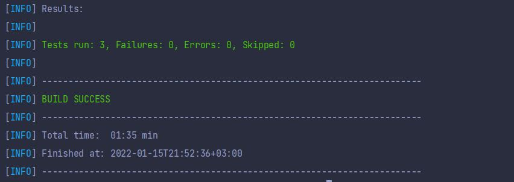

# Mizu UI Otomasyon

Bu projede mizu domainine ait 3 adet senaryonun otomasyonu yazılmıştır. Proje java diliyle yazılmış olup bir maven projesidir. Projede junit, webdrivermanager, log4j, selenium kütüphaneleri kullanılmıştır. 
- Java test otomasyon projelerinde en çok kullanılan dillerden biri ve aktif iş hayatımda kullandığım dil olduğu için bunu tercih ettim.
- Junit testlerimi yazmam için gerekli olan bir kütüphane. Assertionlar, test ve before-after gibi anotasyonları bu kütüphane üzerinden kullanıyorum. Muadili olan TestNG kadar esnek olmasa da kullanımının daha kolay ve aktif iş hayatımda da JUnit kullandığım için bunu tercih ettim.
- Selenium web otomasyonlarında en çok kullanılan kütüphane ve kaynak olarak çeşitliliği çok fazla kullanırken kendimi en rahat hissettiğim ve iş hayatımda da kullandığım bir kütüphane olduğu için tercih ettim.
- WebDriverManager, driver ayağa kaldırmak için bir .exe dosyasına ya da sürekli browser versiyonunuzu kontrol etmenize gerek olmayan kullanımı rahat ve içinde driverleri bulunduran bir kütüphane.
- Log4j ise System.out.println kullanmak yerine runtime’daki durumunu sistematik, kontrol edilebilir, okunabilir şekilde saklamamı sağlayan, hata derecesini belirleyebileceğim bir kütüphane.

Proje page object model yapısına uygun olarak yazılmıştır. Projede herhangi bir statik bekleme kullanılmamış olup beklemelerin hepsi dinamik beklemelerdir. Bu projede yer alan packageler, classlar ve kullanım amaçları;

## Base
### BaseTest.class

BaseTest classı kullanacağım driver ayarlarını verdiğim, Before ve After anatosyanları ile testlerden önce driverı setlediğim, testlerden sonra driverı kapattığım classtır.
### BasePage.class

BasePage classı senaryolarda çok sık kullandığım metotları daha kısa hale getirip daha anlışılır kılmak amacıyla kullandığım bir class. Bu classta oluşturulan metodlar ve kullanım amaçları:
- goUrl(String url): İçine verilen url linkine gidilmek için yazılmıştır.
- findElement(By by): İçine verilen By tipindeki locator değeri sayfada var olana kadar bekleyip bu elementi bulmaya yarayan metot.
- click(By by): Element tıklanabilir olana kadar bekleyip ilgili elemente tıklayan metot.
- sendKeys(By by, String text): By tipinde verilen locator'a String tipindeki text değerini yazmamızı sağlayan metot.
- findElements(By by): Elementler var olana kadar bekleyip bir WebElement listesi dönen metottur.
- elementIsDisplayed(By by): Metodun içine verilen locator değerinin görünür olup olmadığını kontrol etmek için yazdığım metot.
- sortElement(By by): Sorting senaryosu için yazmış olduğum içine verdiğim webelement listesini büyükten küçüğe sıralamaya yarayan metottur.
- assertContainsText(By by,String text): Metot içine verilen By tipindeki elementin String tipindeki text değerini içerip içermediğini test etmek için yazılan metottur.

Burada yazılan metotlar dışında assertion için current url kontrolü ve oxxo senaryosundaki order no'nun 9 haneden oluşup oluşmadığını kontrol etmek için assertionlar kullanılmıştır.
### Constants package

- Senaryolarda kullanmış olduğum String değerleri veya By tipindeki locator değerleri tuttuğum classların yer aldığı packagedir.

### Pages package

- BasePage classındaki metotları ve Constants packagesinde bulunan sabitleri kullanarak senaryo adımlarını oluşturduğumuz package pages packagesidir. Burada oluşturulan senaryo adımları sırasız bir şekildedir.

### Tests package

- Pages kısmında oluşturduğumuz senaryo adımlarını sıralı bir şekilde yazıp senaryomuzu tamamladığımız classlarımızın yer aldığı package Tests packagesidir.

## Senaryolar ve Projeyi çalıştırma işlemi
Bu çalışma da seçilen üç senaryo aşağıdaki gibidir.
- https://www.mizu.com/login sayfasında kullanıcı adı ve şifre başarılı şekilde sign in olunması.
- https://www.mizu.com/flowers sayfasında gönderim yeri ‘mexico city’ seçilerek ilk ürün sepete eklenir ve ilgili adımlar(sepetim, teslimat adresi,fatura bilgileri) tamamlanarak ‘Oxxo’ ile ödeme alınması kontrol edilir.
- https://www.mizu.com/flowers sayfasında filtre alanından sort: price high to low seçilip listeleme sayfasındaki ürünlerin doğru fiyat sırasıyla listelendiğinin kontrolü.

### Projenin ayağa kaldırılıp test caselerin koşulması

Proje bir maven projesi olduğu için maven komutlarıyla bu işlemleri gerçekleştirebiliriz.
- git clone ile kodlar githubdan localimize çekilir.
- Proje konumuna gidilir.
- İlk kez çalıştıracaksak "mvn clean install" komutunu kullanarak maven dosyasımızı baştan yükleyip tüm testleri koşabiliriz.
- Bu işlemi yaptıktan sonra "mvn test" komutu ile istediğimiz zaman testlerimizi koşabiliriz.
- Spesifik bir classtaki testleri koşmak istiyorsak "mvn test -Dtest = "KoşmakİstediğimizClassınAdı"" yaparak istediğimiz classtaki testleri koşabiliriz. Örneğin Oxxo sayfasındaki testimi koşmak istiyorum bunun için "mvn test -Dtest="OxxoTest"" komutunu terminalime yazmam yeterli olacaktır.
- Bir class içindeki spesifik bir testi koşmak istersek "mvn test -Dtest="KoşmakİstediğimizClasAdı#KoşmakİstediğimizMetotAdı"" şeklindeki komutu terminalimizden çalıştırabiliriz.

## Test Sonucu

